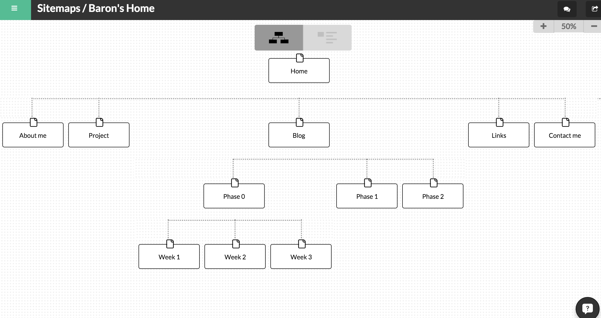

DBC 2.3 Introduction to Design and Site Planning

Below is my own site map:

### What are the 6 Phases of Web Design?

The 6 phases of Web Design that Selene M. Bowlby mentioned are

Phase 1. Information Gathering

The first phase is acutally the most important one as it required solid understanding of the reason why creating the website. The designer should also consider four things: What is the purpose of the site? What are the expecting outcomes? Who are the target audiences? What content are the audiences be looking at on the site?

Phase 2. Planning

On phase 2, the designer now can use the information gathered from phase 1 to device a plan. To organize which information goes to which page.

Phase 3. Design

After set up the structure of the site by employing site map. It is time to design how its look. The look will affect how the taget audiences feel about the site. A designer will normally create a prototype for discussion use.

Phase 4. Development

Once the outlook has been designed. It brings the project to an development stage. Web designer now will implement every individual selected elements and apply them on an actual, functional site.

Phase 5. Testing and Delivery

When the site is done. The web designer will look for and test any technical issues which will prevent the site to go online.

Phase 6. Maintenance

Even the site is successfully online doesn't mean that its journey is over. the website is still in need of maintenance and content update.

### What is your site's primary goal or purpose? What kind of content will your site feature?

My site's primary purpose is to demonstrate my ability as a web developer. I will share my work history, background, things I passionate about as well as a blog. It should serve as my "online resume".

### What is your target audience's interests and how do you see your site addressing them?

Obviously, people who wants to know about me will go to my site. I will set up some way for my audiences to communicate with me. If they couldn't find anything they are looking for, they can directly contact me in order to address this issue.

### What is the primary "action" the user should take when coming to your site? Do you want them to search for information, contact you, or see your portfolio? It's ok to have several actions at once, or different actions for different kinds of visitors.

As I mentioned, my site will serve as my online resume. For people who wants to know about me, their actions should be checking out the "About" page, my "portfolio" page. For people who wants to communicate with me will find their way to contact me on the "contact" page.

### What are the main things someone should know about design and user experience?

Design is always about solving problems. Designing a website is about achieving the most of the purpose of making one. User experience (UX) is all about end user satisfaction.

### What is user experience design and why is it valuable?

User experience design (UXD) is the process of enhancing user satisfaction by improving the usability, accessibilty and how well they feel about the interface and the system. UXD can also refer to user-centered design. It is important because it deals with users. It affects the expectated benefits one is intended to gain from the designs or products.

### Which parts of the challenge did you find tedious?

This challenge required lots of reading. Information are scattered throughout the materials. To finish this reflection I have to go back and forth articles to look for the best answer. The process of jumping back and forth between tabs and windows are tedious.

