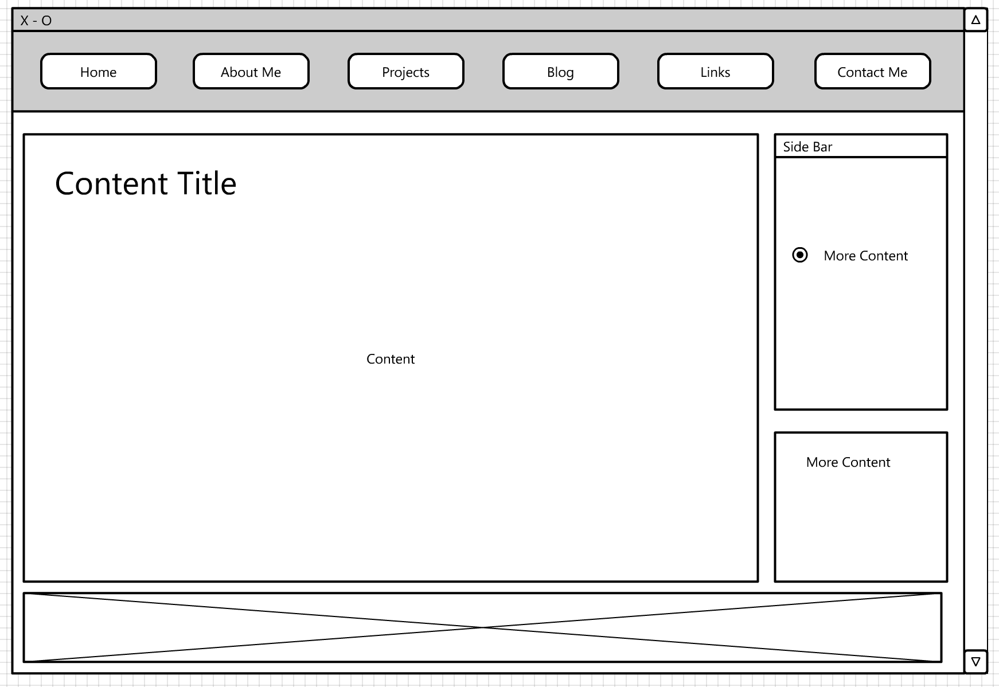
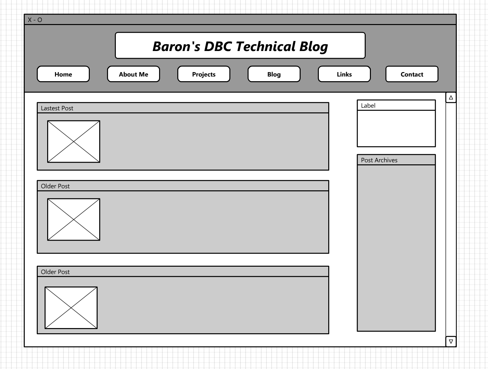

DBC 2.4 Wireframing

My wireframe for my github.io:

My wireframe for my blog:

### What is a wireframe?

A wireframe is a visual guide that represents the skeletal framework of a website. It is created for the purpose of arranging elements to best accomplish whether for business objective or creative idea. It depicts the layout of the website's content, such as interface elements and navigational systems. It forcuses on what the layout does rather than how its looks.

### What are the benefits of wireframing?

Wireframing allows user to define the website's hierarchy by using a simplified wireframe layout. Wireframing normally happens on paper or some graphical softwares depends on user choice. User can then make changes more easily and quickly by altering the elements on the wireframe layout without too focusing on the details. Hence, saved time for the coding process. 

### Did you enjoy wireframing your site?

Yes. I found that quite hard to wireframing site from the begining though. I had googled "wireframing" and try to see how other people wireframe their sites to get some ideas on how to perfect my own site.

### Did you revise your wireframe or stick with your first idea?

I did. As mentioned above, I searched online to checkout how people work on their wireframes. I first started simple and empty. After a revision, it has become better now.

### What questions did you ask during this challenge? What resources did you find to help you answer them?

I first started asking myself "Where can I find a tool to wireframe.". Of course google helped me out. I came to a website called "my.lovelycharts.com/". It provides an online wireframing tool.

### Which parts of the challenge did you enjoy and which parts did you find tedious?

I enjoy the part wireframing my index site. It is a great opportunity to explore the field of UX design and web design. I found that the process of looking up the tool to make wireframe tedious as I don't want to spend too much time to dig around since I don't know which tool is technically the more efficient.

