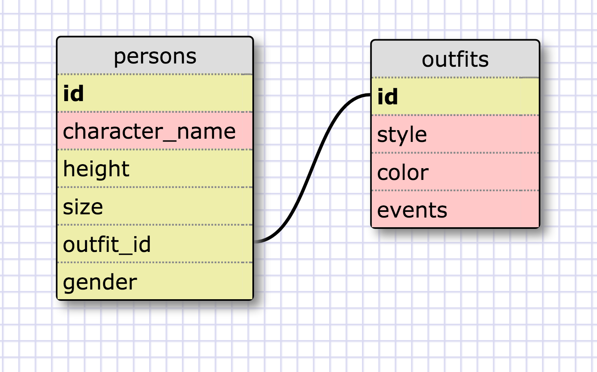

# DBC 8.4

### Release 5

1) Select all data for all states.

	SELECT * FROM states;

2) Select all data for all regions.

	SELECT * FROM regions;

3) Select the state_name and population for all states.

	SELECT state_name, population FROM states;

4) Select the state_name and population for all states ordered by population.
   The state with the highest population should be at the top.

	SELECT state_name, population FROM states ORDER BY population DESC;

5) Select the state_name for the states in region 7.

	SELECT state_name FROM states WHERE region_id = 7;

6) Select the state_name and population_density for states with a population density
   over 50 ordered from least to most dense.

	SELECT state_name, population_density FROM states WHERE population_density > 50 ORDER BY population_density ASC;

7) Select the state_name for states with a population between 1 million and 1.5 million people.

	SELECT state_name FROM states WHERE population BETWEEN 1000000 AND 1500000;

8) Select the state_name and region_id for states ordered by region in ascending order.

	SELECT state_name, region_id FROM states ORDER BY region_id ASC;

9) Select the region_name for the regions with "Central" in the name.

	SELECT region_name FROM regions WHERE region_name LIKE '%Central%';

10) Select the region_name and the state_name for all states and regions in ascending order by
	region_id. Refer to the region by name. (This will involve joining the tables).

	SELECT regions.region_name, states.state_name FROM regions INNER JOIN states ON states.region_id = regions.id;

## Release 6 # Required Schema Design:

## Release 7 # Reflection

### What are databases for?

Databases are used for create, update and administer data / information.

### What is a one-to-many relationship?

One-to-many relationship means one item has relation with many items. It is better to	explain by using an example: A student can take more than one class in a semester. That's a one-to-many relationship.

### What is a primary key? What is a foreign key? How can you determine which is which?

Primary key is used for uniquely identifies every records of the table. A foreign key of a
child table is a primary key of a parent table, used to reference the parent table. You can
determine which is which by thinking which table you are on and which table is used for 
reference.

### How can you select information out of a SQL database? What are some general guidelines for that?

One will need to use the SQL (Structured Query Language) to send command to the database in 
order to select information from the database.

